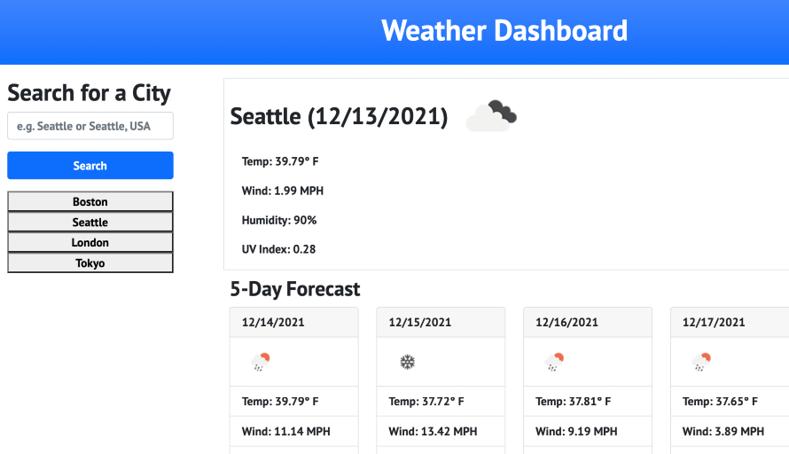
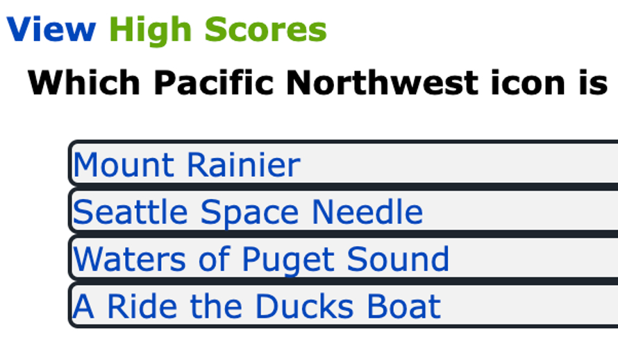
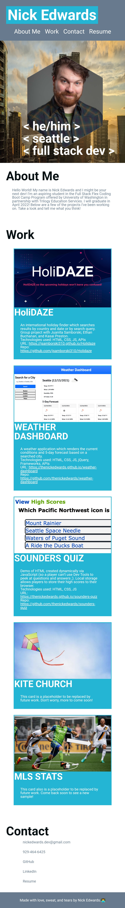

# portfolio
Welcome to my portfolio! First of all thank you for being so thorough as to check out the readme! You must be good at your job and thorough to boot. I think we'll work well together!

This portoflio began as a Week 2 homework assignment in coding bootcamp. All the images and links were mere placeholders for the awesomeness to come.  A few weeks later and the site is beginning to take shape as a place to share my work, contact info, and a little about myself. There's more work to do and I'm ready for it.

Here's a look back at the requirements for each assignment.
Week 2 accepatance criteria listed in [W2-hw_README.md](W2-hw_README.md).
Week 8 accepatance criteria listed in [W8-hw_README.md](W8-hw_README.md).
## Links
URL for published page: https://thenickedwards.github.io/portfolio/

URL for GitHub repo: https://github.com/thenickedwards/portfolio
## Work Samples
* HoliDAZE

An international holiday finder which searches results by country and date or by search query.  Group project with Juanita Samborski, Ethan Buchanan, and Kasai Preston. Technologies used: HTML, CSS, JS, APIs

URL: https://jsamborski310.github.io/Holidaze

Repo: https://github.com/jsamborski310/Holidaze

* Weather Dashboard

A weather application which renders the current conditions and 5-day forecast based on a searched city. Technologies used: HTML, CSS, JS, jQuery, Frameworks, APIs

URL: https://thenickedwards.github.io/weather-dashboard

Repo: https://github.com/thenickedwards/weather-dashboard

* Sounders Quiz

Demo of HTML created dynamically via JavaScript (so a player can’t use Dev Tools to peek at questions and answers ;).  Local storage allows players to store their high scores to their browser. Technologies used: HTML, CSS, JS

URL: https://thenickedwards.github.io/sounders-quiz

Repo: https://github.com/thenickedwards/sounders-quiz

* The final two images in the porfolio are plceholders, though rest assured my code will soon replace those with live, vibrant sites coded by yours truly.

## Screenshots
Screenshot of Nick Edwards' portfolio webpage in desktop browser.

Screenshot of Nick Edwards' portfolio webpage in mobile browser.

## Contact Info
GitHub - https://github.com/thenickedwards
LinkedIn - https://www.linkedin.com/in/nick-edwards-dev/
📱 929-464-6425
📧 nickedwards.dev@gmail.com

## Post Scriptum
Have a look around the work samples and let me know what you think! If you want to start a conversation or have any questions, my contact info is just above. Thanks again for stopping by and have a great day!