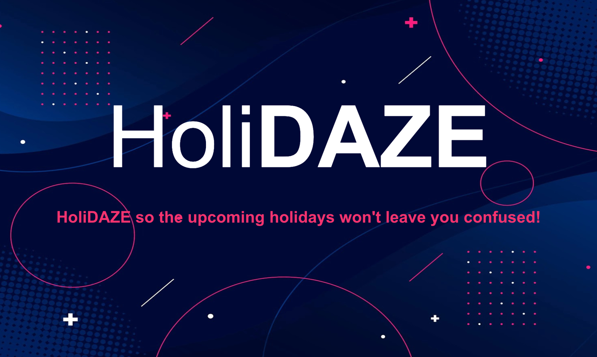
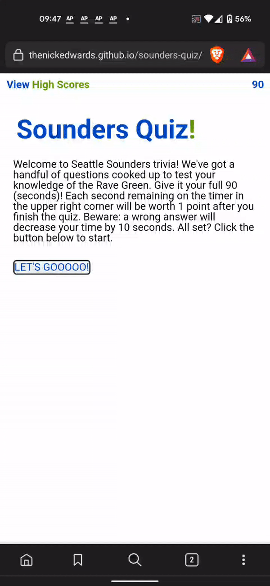

# portfolio
Welcome to my portfolio! First of all thank you for being so thorough as to check out the readme! You must be good at your job. I think we'll work well together!

This portfolio began as a Week 2 homework assignment in coding bootcamp. All the images and links were mere placeholders for the awesomeness to come.  A few weeks later and the site is beginning to take shape as a place to share my work, contact info, and a little about myself. There's more work to do and I'm ready for it.

Here's a look back at the requirements for each assignment.

Week 2 acceptance criteria listed in [W2-hw_README.md](/z-archive/W2-hw_README.md).

Week 8 acceptance criteria listed in [W8-hw_README.md](/z-archive/W8-hw_README.md).

Week 16 acceptance criteria listed in [W16-hw_README.md](/z-archive/W16-hw_README.md).

## Links & License
URL for published page: https://thenickedwards.github.io/portfolio/

URL for GitHub repo: https://github.com/thenickedwards/portfolio

## Work Samples
* HoliDAZE

An international holiday finder which searches results by country and date or by search query.  Group project with Juanita Samborski, Ethan Buchanan, and Kasai Preston. Technologies used: HTML, CSS, JS, APIs

URL: https://jsamborski310.github.io/Holidaze

Repo: https://github.com/jsamborski310/Holidaze

* Game Notes

A platform for collecting thoughts, observations, questions, etc. on recent soccer games (rather than a tech blog) allowing a head to could coordinate and collaborate with their coaching staff, medical personnel, data analysts, and players. Technologies used: HTML, Handlebars, CSS, JS, APIs, MVC, Sequelize, Express, Heroku

Heroku URL: https://gamenotes-thenickedwards.herokuapp.com/

Repo: https://github.com/thenickedwards/game-notes

* Happy Habit Tracker

An application to keep tabs on your physical, mental, and dietary health. Maintain your well-being by tracking good habits! Technologies used: HTML, Handlebars, CSS, JS, Chart.js, APIs, MVC, Sequelize, Express, Heroku

Heroku URL: https://happy-habit-tracker-app.herokuapp.com/

Repo: https://github.com/chandrapanda/happy-habit-tracker

* Sounders Quiz

Demo of HTML created dynamically via JavaScript (so a player can’t use Dev Tools to peek at questions and answers ;).  Local storage allows players to store their high scores to their browser. Technologies used: HTML, CSS, JS

URL: https://thenickedwards.github.io/sounders-quiz

Repo: https://github.com/thenickedwards/sounders-quiz

* good-readme-generator

A Command-line application that accepts user input and generates a high-quality, professional README.md. Generated readme includes the title of project and sections entitled Description, Table of Contents, Installation, Usage, License, Contributing, Tests, and Questions. Available licenses include badge. GitHub username, email, and table of contents clickable. Technologies used: JS, Inquirer, fs/file system

Demo Video of CLI on Google Drive: https://drive.google.com/file/d/1jIMywy9jxhm8zK6Pv2GPztcIyaX4DLUx/view

Repo: https://github.com/thenickedwards/good-readme-generator

## Screenshots
Screenshot of Nick Edwards' portfolio webpage in desktop browser.

Screenshot of Nick Edwards' portfolio webpage in mobile browser.

## Contact Info
GitHub - https://github.com/thenickedwards

LinkedIn - https://www.linkedin.com/in/nick-edwards-dev/

📱 929-464-6425

📧 nickedwards.dev@gmail.com

[Downloadable pdf Resume on Google Drive](https://drive.google.com/file/d/1MpF32DjePh1AnBQxJnQvAtt_kUL-e0iV/view?usp=sharing)

## Post Scriptum
Have a look around the work samples and let me know what you think! If you want to start a conversation or have any questions, my contact info is just above. Thanks again for stopping by and have a great day!